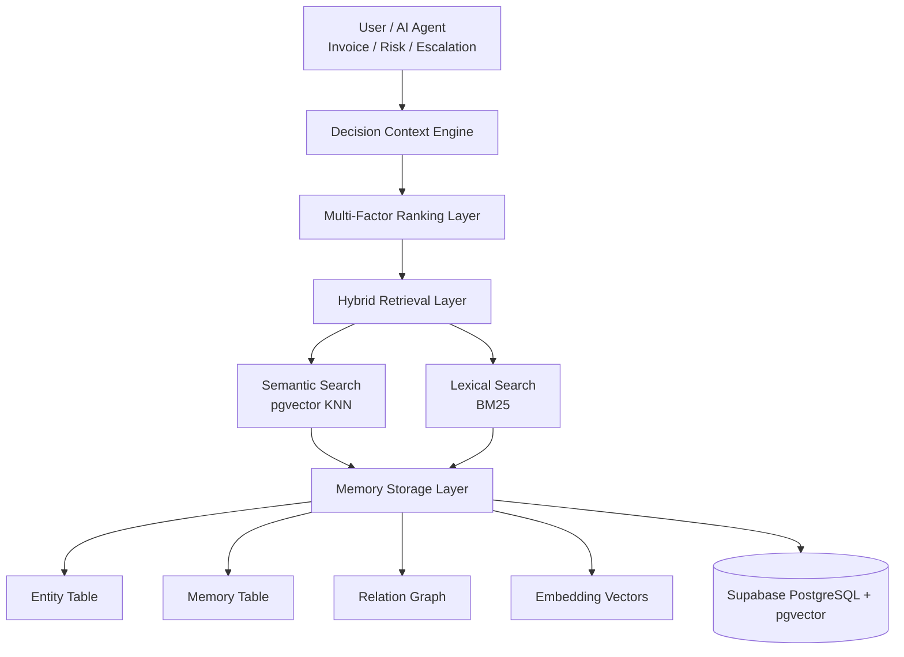

# Enterprise Context & Memory Engine for AI Decision Support

## Overview

This project implements a **Hybrid Context & Memory Management Engine** designed for AI agents operating in enterprise business environments.

The system is **not a chatbot** and **not a simple search engine**.

It is a **decision-support memory engine** that enables AI systems to:

- Maintain relevant business context across interactions  
- Retrieve historical information when it impacts decisions  
- Manage memory lifecycle (fresh, aging, stale, evergreen)  
- Handle conflicting historical signals  
- Balance context richness against information overload  
- Provide explainable relevance scoring  

The architecture is inspired by:

- Enterprise AI copilots  
- Vendor risk evaluation systems  
- CRM escalation prioritization engines  
- Financial fraud detection models  

---

# Problem Statement

In business operations, decisions are rarely made in isolation.

Human professionals rely on multiple layers of context:

- **Immediate context** (current transaction details)  
- **Historical context** (past interactions and incidents)  
- **Temporal context** (recency and staleness of information)  
- **Experiential context** (patterns and trends over time)  

This system models that layered reasoning process for AI agents.

---

# System Architecture

The system is structured into five logical layers:

---

## 1 Memory Storage Layer

Stores structured and unstructured business memory.

### Memory Types

1. **Episodic Memory**
   - Events
   - Incidents
   - Order reviews
   - Support tickets

2. **Semantic Memory**
   - Contracts
   - Policies
   - Evergreen rules

3. **Pattern Memory**
   - Aggregated trends
   - Risk indicators

4. **Relational Memory**
   - Entity graph connections

---

### Core Data Model

- `Entity` (supplier, invoice, customer, etc.)
- `Memory`
- `Relation`

Each memory includes:

- Content
- Memory type
- Severity score
- Timestamp
- Embedding vector
- Stale flag
- Associated entity

---

## 2️ Retrieval Layer (Hybrid Retrieval)

The system uses two complementary retrieval strategies:

### -> Semantic Retrieval
- Embeddings stored using `pgvector` (PostgreSQL extension)
- Approximate Nearest Neighbor (ANN) search
- Retrieves semantically similar memories

### -> Lexical Retrieval
- BM25 keyword-based ranking
- Useful for exact term matching

Both retrieval methods produce candidate memory sets.

---

## 3️ Multi-Factor Ranking Layer

Memories are ranked using a weighted multi-factor scoring function:
### Ranking Factors

- **Semantic Similarity** – Meaning relevance
- **Temporal Weight** – Exponential decay based on age
- **Severity Weight** – Business impact magnitude
- **Graph Weight** – Entity relationship proximity
- **Trend Weight** – Improvement or deterioration signal

This ensures balanced contextual relevance.

---

## 4️⃣ Intelligence Layer

Performs higher-level contextual reasoning.

###  Trend Detection
- Rolling window comparison
- Recent vs historical average severity
- Detects improving or worsening behavior

###  Conflict Resolution
If historical severe issues exist but recent performance improves:
- Trend analysis overrides outdated clusters

###  Risk Spike Detection
If sudden severe incidents occur:
- Alert is elevated
- Past stability does not mask recent deterioration

---

## 5.  Decision Context Output Layer

The system does not return raw database rows.

Instead, it produces structured output:

- Risk summary
- Trend direction
- Critical incidents
- Reliability score
- Explanation of scoring components

This prevents information overload and improves interpretability.

---

#  Memory Lifecycle Management

Memory is categorized into lifecycle states:

| State      | Behavior |
|------------|----------|
| Fresh      | High priority |
| Aging      | Downweighted |
| Stale      | Archived or suppressed |
| Evergreen  | Never decays |

### Example Lifecycle Rule

- Memory older than threshold with no recurrence → marked stale  
- Severe compliance events decay slower  
- Contracts and policy rules never decay  

---

#  Handling Conflicting Information

Example scenario:

- Severe issues 6 months ago  
- Stable performance last 90 days  

System behavior:

- Detect improvement trend  
- Downweight outdated cluster  
- Emphasize recent stability  

Trend > isolated historical events.

---

#  Preventing Information Overload

To ensure efficient decision-making:

- Top-K retrieval
- Pattern grouping
- Aggregated summaries
- Structured output instead of raw memory dump

---

#  Scalability Strategy

Designed to scale to large enterprise datasets:

- `pgvector` ANN indexing
- Pagination support
- Archival partitioning for stale memory
- Caching frequently accessed entities
- Asynchronous embedding generation

---

#  Explainability

Each retrieved memory includes scoring transparency:

- Semantic similarity score
- Temporal decay weight
- Severity multiplier
- Graph proximity boost
- Trend adjustment

This ensures auditability and trust in AI-driven decisions.

---

# Demonstration Use Case

### Supplier Performance Intelligence

When a new invoice arrives:

1. Retrieve historical supplier context  
2. Rank relevant memories  
3. Detect recent trends  
4. Apply lifecycle filtering  
5. Output reliability and risk summary  

---

#  Summary

This project demonstrates a hybrid context engine capable of enterprise decision support through:

- Semantic retrieval
- Graph reasoning
- Temporal modeling
- Trend detection
- Lifecycle control
- Explainable multi-factor ranking

It models how experienced human professionals leverage layered context in real-world business decisions.

